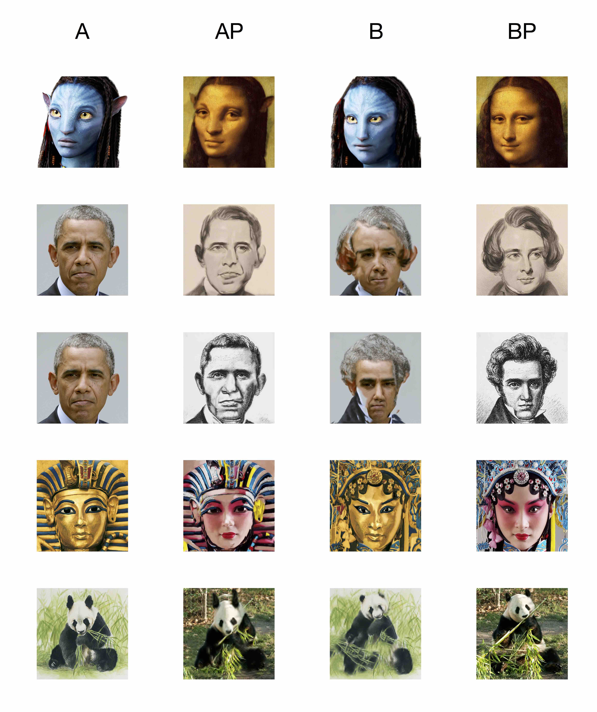

Deep-Image-Analogy

[](https://996.icu)
==============================

This project is a python implementation of Deep Image Analogy.https://arxiv.org/abs/1705.01088.

## Some results



## Requirements

 - python 3

 - opencv3

   If you use anaconda, you can install opencv3 by  ```conda install opencv```

 - pytorch

   See [pytorch](http://pytorch.org/) for installation

   Codes in branch "master" works with pytorch 0.4

   Codes in branch "pytorch0.3" works with pytorch 0.3

 - cuda (CPU version is not implemented yet)

## Usage (demo)

```bash
python main.py --resize_ratio 0.5 --weight 2 --img_A_path data/demo/ava.png --img_BP_path data/demo/mona.png --use_cuda True
```

## Acknowledgments

My project acknowledge the official code [Deep-Image-Analogy](https://github.com/msracver/Deep-Image-Analogy), [pytorch](http://pytorch.org/), and [another pytorch implementation](https://github.com/harveyslash/Deep-Image-Analogy-PyTorch). Especially, thanks for the authors of this amazing algorithm.